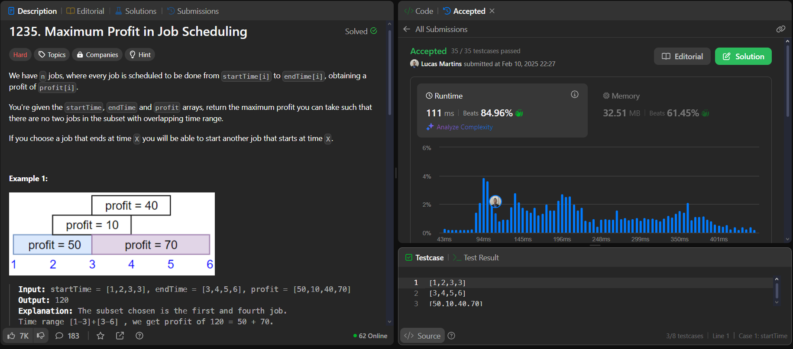

# Problems

**Número da Lista**: 1 
**Conteúdo da Disciplina**: Programação Dinâmica 

## Alunos
| Matrícula | Aluno                 |
| --------- | --------------------- |
| 211061805 | Guilherme Westphall   |
| 221022088 | Lucas Martins Gabriel |

## Sobre 

O trabalho consiste em resolver problemas de programação dinâmica, de plataformas como Leetcode e GeekForGeeks. Os problemas resolvidos são: Bellman-Ford, Knapsack 0-1, Knapsack with duplicate items, Longest Common Subsequence e Maximum Profit in Job Scheduling.

## Problemas 

| Problema                                                                                                                                                                        | Dificuldade |
| ------------------------------------------------------------------------------------------------------------------------------------------------------------------------------- | ----------- |
| [Bellman-Ford](https://www.geeksforgeeks.org/problems/distance-from-the-source-bellman-ford-algorithm/1?itm_source=geeksforgeeks&itm_medium=article&itm_campaign=practice_card) | Medium      |
| [Knapsack 0-1](https://www.geeksforgeeks.org/problems/0-1-knapsack-problem0945/1)                                                                                               | Medium      |
| [Knapsack with duplicate items](https://www.geeksforgeeks.org/problems/knapsack-with-duplicate-items4201/1)                                                                     | Medium      |
| [Longest Common Subsequence ](https://www.geeksforgeeks.org/problems/longest-common-subsequence-1587115620/1?page=1&category=Dynamic%20Programming&sortBy=submissions)          | Medium      |
| [Maximum Profit in Job Scheduling](https://leetcode.com/problems/maximum-profit-in-job-scheduling/)                                                                             | Hard        |

## Screenshots

### Bellman-Ford

### Knapsack 0-1

### Knapsack with duplicate items

### Longest Common Subsequence

### Maximum Profit in Job Scheduling

## Instalação 
**Linguagem**: C++ e Python 

## Uso 
Para testar as soluções basta submeter o código nas respectivas plataformas de exercícios.

## Vídeo

https://youtu.be/GYC9sDmSL-U

